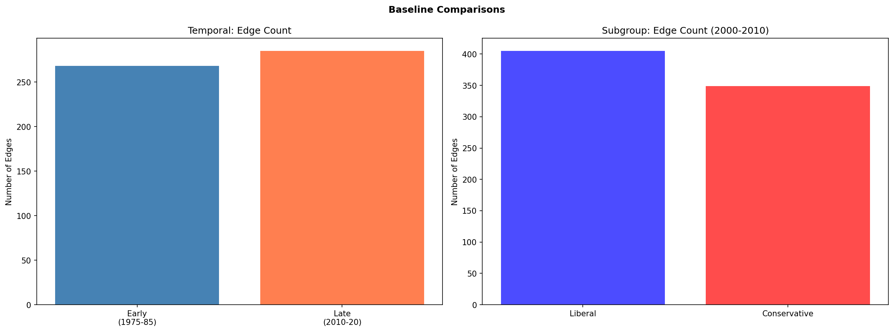

# Baseline Comparisons

**Notebook:** `notebooks/baseline_03_comparisons.ipynb`
**Date:** 2026-02

## Question

How does the belief network change over time and between groups?

## Part A: Temporal Comparison (1975–1985 vs 2010–2020)

### Network Dimensions

| Metric | Early (1975–1985) | Late (2010–2020) |
|--------|-------------------|-------------------|
| Variables | 91 | 121 |
| Common variables | 91 | 91 |
| Late-only variables | — | 30 |

42 variables were filtered from the early period (insufficient data), vs 12 from the late period. The early network has significantly fewer nodes because many GSS items were introduced after 1985.

### Structural Comparison (91 common variables)

| Metric | Early | Late | Delta |
|--------|-------|------|-------|
| Edges | 264 | 285 | +21 |
| Density | 0.065 | 0.070 | +0.005 |
| Avg degree | 5.80 | 6.26 | +0.46 |
| Avg weight sum | 0.408 | 0.446 | +0.038 |
| Clustering coeff. | 0.488 | 0.437 | −0.051 |
| Triangles | 359 | 362 | +3 |
| Spectral gap | 0.690 | 0.190 | −0.500 |
| Communities | 22 | 23 | +1 |

The late-period network is slightly denser (+21 edges) with stronger average connections, but clustering decreased — beliefs became more interconnected overall but less locally clustered. The large drop in spectral gap suggests community structure became less pronounced.

**Similarity:** Pearson r = 0.901, Spearman r = 0.680, Euclidean distance = 0.770. The two periods are highly correlated in overall structure.

**Graph Edit Distance:** 3,180 (normalized: 0.438).

### Top Differential Edges

**Edges stronger in the early period (1975–1985):**
- RELIG_Protestant – RELIG_Catholic (+0.226): Religious identity categories were more sharply separated
- HOMOSEX – XMARSEX (+0.117): Homosexuality and extramarital sex attitudes were more tightly linked
- NATRACE – HELPBLK (+0.117): Racial spending and helping Black people attitudes diverged

**Edges stronger in the late period (2010–2020):**
- HOMOSEX – PREMARSX (+0.167): Homosexuality and premarital sex became more tightly linked
- POLVIEWS – PARTYID (+0.142): Political ideology and party ID became more aligned (polarization)
- RELIG_Protestant – RELIG_None (+0.131): Protestant vs None became a more significant divide
- NATARMS – PRESLAST_DEMREP (+0.105): Military spending became more partisan
- NATENVIR – PRESLAST_DEMREP (+0.101): Environmental spending became more partisan

### Centrality Shift

**Top betweenness centrality:**

| Rank | Early | Late |
|------|-------|------|
| 1 | NATSPAC (0.401) | ABANY (0.215) |
| 2 | LIBATH (0.387) | PRESLAST_DEMREP (0.193) |
| 3 | GRASS (0.298) | HOMOSEX (0.161) |
| 4 | EQWLTH (0.251) | CONCLERG (0.139) |
| 5 | NATSOC (0.244) | FEFAM (0.133) |

In the early period, civil liberties (LIBATH) and spending priorities (NATSPAC) were the key bridge variables. By the late period, partisan voting (PRESLAST_DEMREP) and moral issues (HOMOSEX, ABANY) became central — reflecting increased partisan sorting around cultural issues.

**Top strength:**

| Rank | Early | Late |
|------|-------|------|
| 1 | LIBCOM (1.088) | PRESLAST_DEMREP (1.961) |
| 2 | COLHOMO (1.047) | HOMOSEX (1.375) |
| 3 | ABNOMORE (1.032) | PREMARSX (1.145) |

PRESLAST_DEMREP (partisan voting) dramatically increased in strength from 2010–2020, consistent with increased partisan polarization.

### Balance Evolution

| Period | Balanced | Unbalanced | % Balanced |
|--------|----------|------------|------------|
| Early (1975–1985) | 358 | 1 | 99.7% |
| Late (2010–2020) | 566 | 5 | 99.1% |

Both periods are highly balanced. The late period has 4 additional unbalanced triads (all in the child-rearing values cluster: OBEY/THNKSELF/WORKHARD/HELPOTH). The RELIG_Protestant–Catholic–None triad is unbalanced in both periods.

---

## Part B: Subgroup Comparison (Liberal vs Conservative, 2000–2010)

### Network Dimensions

| Metric | Liberal | Conservative |
|--------|---------|--------------|
| Filtered respondents | 17,604 (24.3%) | 21,122 (29.2%) |
| Variables | 120 | 119 |
| Common variables | 107 | 107 |

### Structural Comparison (107 common variables)

| Metric | Liberal | Conservative | Delta |
|--------|---------|--------------|-------|
| Edges | 368 | 291 | +77 |
| Density | 0.065 | 0.051 | +0.014 |
| Avg degree | 6.88 | 5.44 | +1.44 |
| Avg weight sum | 0.440 | 0.417 | +0.023 |
| Clustering coeff. | 0.406 | 0.421 | −0.015 |
| Triangles | 507 | 318 | +189 |
| Spectral gap | 0.090 | 0.351 | −0.261 |
| Communities | 32 | 30 | +2 |

**Key finding:** The liberal network is substantially denser (77 more edges, +27%) than the conservative network. Liberals have more interconnected beliefs (more edges, higher average degree, nearly 60% more triangles). However, conservatives have slightly higher clustering and a larger spectral gap, suggesting more distinct belief communities.

**Similarity:** Pearson r = 0.907, Spearman r = 0.606, Euclidean distance = 0.815.

### Top Differential Edges

**Edges stronger in liberal network:**
- HOMOSEX – PRAYER (+0.124): For liberals, attitudes on homosexuality are more tied to religious practice
- RELIG_Catholic – RELIG_None (+0.120): Catholic vs None distinction is sharper among liberals
- NATENRGY – NATSCI (+0.119): Energy and science spending are more linked for liberals
- LIBMSLM – TRUST (+0.109): Muslim tolerance is more tied to interpersonal trust for liberals
- WRKWAYUP – AFFRMACT (+0.099): Work ethic and affirmative action attitudes are more connected for liberals

**Edges stronger in conservative network:**
- PRESLAST_DEMREP – WOULDVOTELAST_DEMREP (+0.212): Partisan voting is more consistently linked for conservatives
- RELIG_Protestant – RELIG_Catholic (+0.205): Protestant-Catholic distinction is sharper for conservatives
- ABDEFECT – LETDIE1 (+0.142): Abortion for defects and right-to-die are more linked for conservatives
- PORNLAW – PREMARSX (+0.103): Pornography and premarital sex attitudes are more tightly coupled for conservatives
- OBEY – WORKHARD (+0.103): Child-rearing values are more interconnected for conservatives

### Balance Comparison

| Group | Balanced | Unbalanced | % Balanced |
|-------|----------|------------|------------|
| Liberal | 526 | 5 | 99.1% |
| Conservative | 424 | 5 | 98.8% |

Both groups are highly balanced with the same 5 unbalanced triads (child-rearing + religion clusters). The liberal network has more total triads (531 vs 429) consistent with its higher density.

## Temporal Visualization

Interactive temporal network visualization (1976–2020) saved to: `outputs/baseline_temporal_network_1976_2020.html`

## Key Takeaways

1. **Partisan sorting increased over time:** POLVIEWS–PARTYID correlation strengthened (+0.142), and PRESLAST_DEMREP became the highest-strength node in the late period.
2. **Cultural issues became more partisan:** Military spending, environmental spending, and religious identity became more strongly tied to partisan voting in the late period.
3. **Liberal networks are denser:** Liberals have 27% more edges than conservatives, suggesting more interconnected belief systems. Conservatives show more distinct belief communities (higher spectral gap).
4. **Structural balance is universal:** All networks (early, late, liberal, conservative) show >98.8% balanced triads with the same tension points (child-rearing values, religion categories).
5. **Centrality shifted from civil liberties to partisanship:** Bridge variables moved from tolerance/spending items (early) to partisan voting and cultural issues (late).

## Figures

