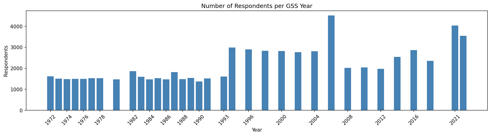
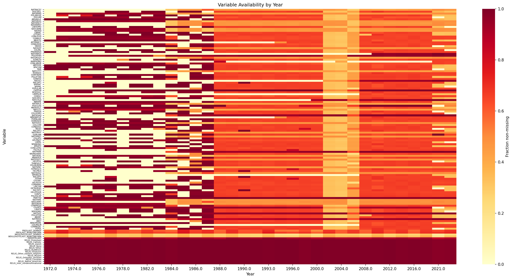
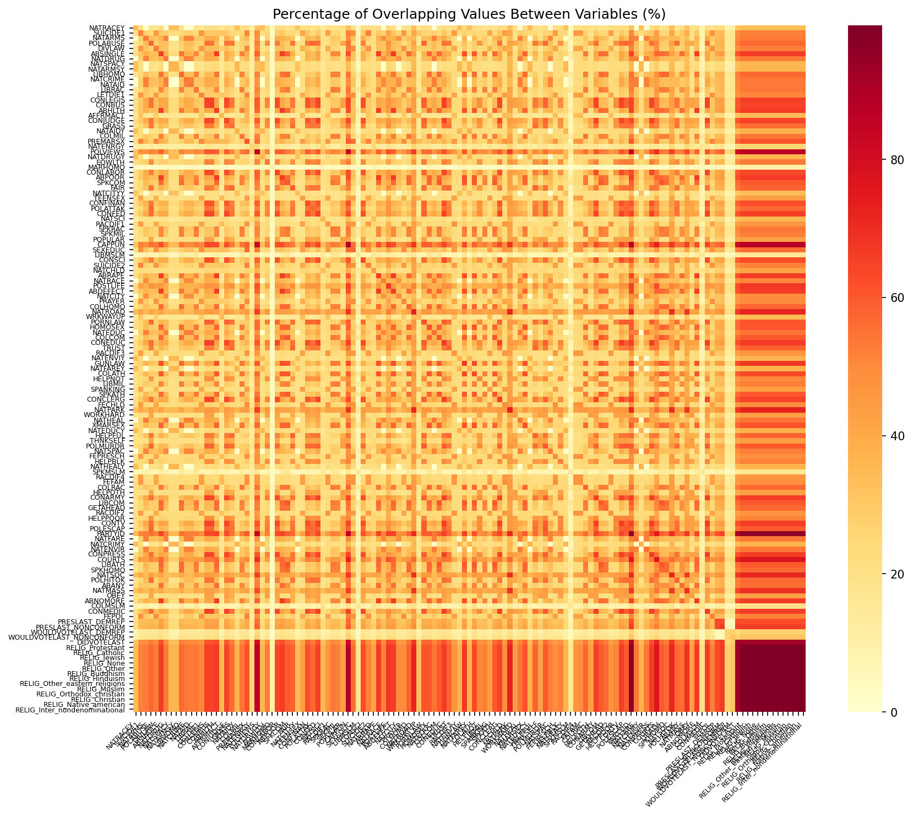
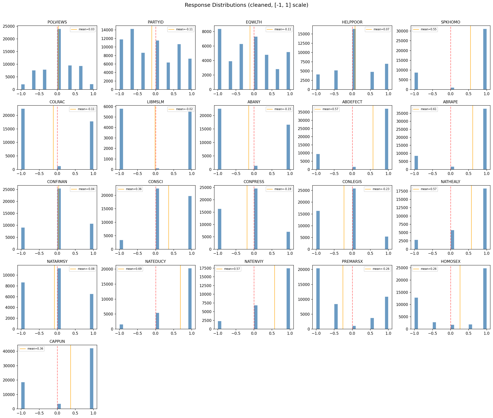

# Baseline Data Landscape

**Notebook:** `notebooks/baseline_01_data_landscape.ipynb`
**Date:** 2026-02

## Question

What data do we have?

## Dataset Dimensions

| Metric | Raw | Cleaned |
|--------|-----|---------|
| Respondents | 72,390 | 72,390 |
| Variables | 166 | 136 |
| Belief variables | — | 133 (excl. YEAR/BALLOT/ID) |
| Year range | 1972–2022 | 1972–2022 |
| Unique survey years | 34 | 34 |

Respondents per year range from 1,372 (1990) to 4,510 (2006), with a mean of ~2,129.

## Variable Completeness

Missingness is substantial — most variables are not asked every year:

| Missing % | Count |
|-----------|-------|
| <25% | 18 |
| 25–50% | 79 |
| 50–75% | 32 |
| >75% | 4 |

The most-missing variables include MARHOMO (90%), SPKMSLM/LIBMSLM (~84%), and COLMSLM (81%) — Muslim-tolerance items added only in recent years. Religion dummy variables (RELIG_*) are the most complete.

**Variable availability grows over time:** the early period (1972–1985) averages ~77 variables per year, while the late period (2010–2022) averages ~130. This means early-period networks will have fewer nodes.

## Pairwise Overlap

When two variables co-occur (both have non-null values for the same respondent):

| Statistic | Value |
|-----------|-------|
| Min overlap | 0.0% |
| Median overlap | 33.5% |
| Mean overlap | 35.8% |
| Max overlap | 99.4% |
| Pairs with <10% overlap | 480 |
| Pairs with <5% overlap | 217 |

Many variable pairs have very low overlap, primarily involving items asked on different survey ballots or in different eras. This is important context for correlation estimation.

## Response Distributions

After cleaning (all variables mapped to [-1, 1]):

- **60 of 133 variables** have |skew| < 0.5 (roughly symmetric)
- Most left-skewed: POLATTAK (skew = −2.73), ABHLTH (−2.42), SEXEDUC (−2.26) — strong consensus items where most respondents agree
- Most right-skewed: Religion dummies (RELIG_Hinduism, RELIG_Muslim, etc. with skew >16) — these are indicator variables with very low base rates
- Core political/social variables (POLVIEWS, PARTYID, EQWLTH) are reasonably symmetric

## Key Takeaways

1. The dataset is large (72K respondents, 133 belief variables, 50 years) but sparse — only ~36% of variable pairs overlap on average.
2. Variable availability increases substantially over time, which affects temporal comparisons.
3. Most core attitude variables are reasonably symmetric after cleaning, but some consensus items and rare-category indicators are heavily skewed.
4. Analysts should be cautious about early-period networks having fewer variables (77 vs 130).

## Figures

