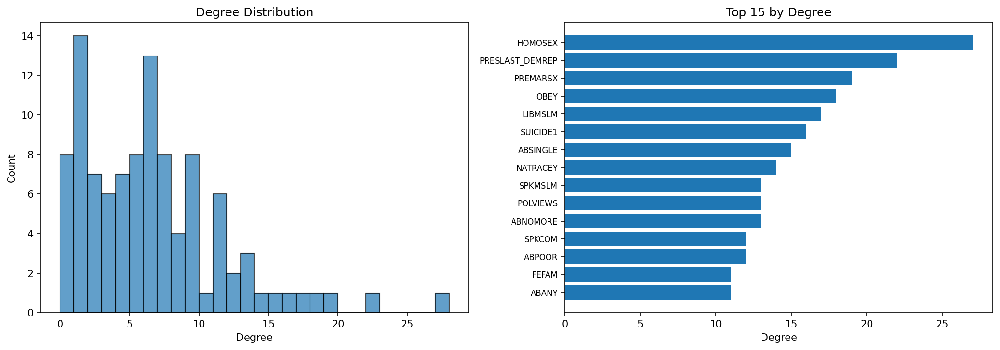
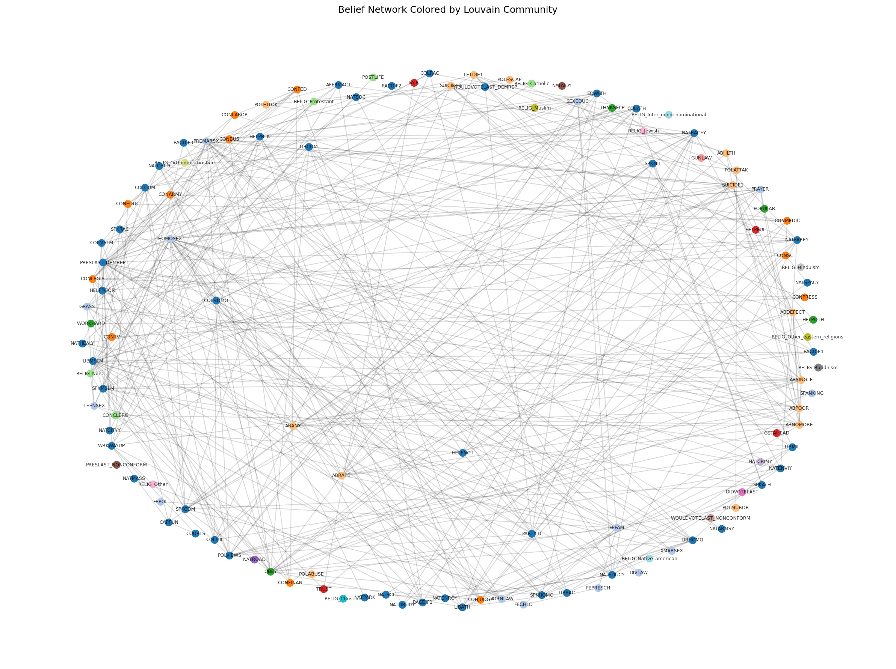

# Baseline Network Anatomy

**Notebook:** `notebooks/baseline_02_network_anatomy.ipynb`
**Date:** 2026-02

## Question

What does one belief network look like?

## Reference Network

**Period:** 2000–2010 (biennial GSS years: 2000, 2002, 2004, 2006, 2008, 2010)
**Method:** Regularized partial Pearson correlation (graphical LASSO, alpha=0.2)

## Method Comparison

| Method | Variables | Non-zero edges | Notes |
|--------|-----------|----------------|-------|
| Simple Pearson | 133 | 8,572 | Fully connected, includes indirect correlations |
| Partial Pearson (unregularized) | — | FAILED | Singular matrix — too many variables for sample size |
| Regularized partial (alpha=0.2) | 121 | 371 | Sparse, direct relationships only |

**Key finding:** Unregularized partial correlation fails entirely because the correlation matrix is singular. This validates the choice of regularization. The regularized method reduces 8,572 edges to 371 (96% reduction), keeping only the strongest direct relationships.

Simple vs Regularized comparison: Pearson r = 0.566, Spearman r = 0.378, Euclidean distance = 9.249. The methods agree on the general direction of relationships but disagree substantially on magnitude and which edges survive.

## Network Statistics

| Metric | Value |
|--------|-------|
| Nodes | 121 |
| Edges | 371 |
| Density | 0.051 |
| Average degree | 6.13 |
| Clustering coefficient | 0.444 |
| Global clustering (transitivity) | 0.429 |

The network is sparse (5.1% density) but moderately clustered, indicating that beliefs tend to form local clusters of interconnected attitudes.

## Degree Distribution

The network is heterogeneous — some variables are much more connected than others:

**Most connected (top 10):**

| Variable | Degree |
|----------|--------|
| HOMOSEX | 27 |
| PRESLAST_DEMREP | 22 |
| PREMARSX | 19 |
| OBEY | 18 |
| LIBMSLM | 17 |
| SUICIDE1 | 16 |
| ABSINGLE | 15 |
| NATRACEY | 14 |
| POLVIEWS | 13 |
| ABNOMORE | 13 |

HOMOSEX (attitudes toward homosexuality) is the most connected variable, with 27 direct edges — suggesting it sits at the intersection of moral, religious, and political belief clusters.

## Centrality Rankings

**Top 10 by betweenness centrality** (bridge variables connecting different parts of the network):

| Variable | Betweenness |
|----------|-------------|
| HOMOSEX | 0.276 |
| PRESLAST_DEMREP | 0.271 |
| ABNOMORE | 0.245 |
| SPKCOM | 0.244 |
| OBEY | 0.231 |
| CONCLERG | 0.188 |
| PRAYER | 0.124 |
| POLVIEWS | 0.122 |
| CONLEGIS | 0.094 |
| ABSINGLE | 0.091 |

**Top 10 by strength** (sum of absolute edge weights):

| Variable | Strength |
|----------|----------|
| PRESLAST_DEMREP | 1.431 |
| HOMOSEX | 1.283 |
| LIBCOM | 1.111 |
| SPKMSLM | 1.079 |
| ABSINGLE | 1.060 |
| PREMARSX | 1.044 |
| SPKCOM | 1.010 |
| LIBMSLM | 0.985 |
| ABNOMORE | 0.983 |
| HELPBLK | 0.973 |

HOMOSEX and PRESLAST_DEMREP dominate both metrics — attitudes toward homosexuality and partisan voting are the most central beliefs in the 2000–2010 network.

## Structural Balance

| Metric | Value |
|--------|-------|
| Total triads | 521 |
| Balanced (positive product) | 516 (99.0%) |
| Unbalanced (negative product) | 5 (1.0%) |
| Balance ratio | 103:1 |

The network is overwhelmingly balanced. The 5 unbalanced triads are:
- OBEY–THNKSELF–HELPOTH (child-rearing values cluster)
- OBEY–THNKSELF–WORKHARD
- OBEY–HELPOTH–WORKHARD
- THNKSELF–HELPOTH–WORKHARD
- RELIG_Protestant–RELIG_Catholic–RELIG_None

The child-rearing triad (OBEY vs THNKSELF/WORKHARD/HELPOTH) creates structural tension because valuing obedience is negatively correlated with valuing independent thinking, but both are positively correlated with valuing hard work.

## Frustration Analysis

Frustration was computed in 0.27 seconds. No edges had >25% frustration — the network is nearly frustration-free under optimal belief assignments.

Top frustrated edges (all <1%):

| Edge | Frustration % | Weight |
|------|--------------|--------|
| RELIG_Catholic – RELIG_None | 0.80% | −0.153 |
| OBEY – WORKHARD | 0.58% | −0.098 |
| THNKSELF – HELPOTH | 0.58% | −0.113 |

The same child-rearing and religion variables that produce unbalanced triads are also the most frustrated edges.

## Visualization

Interactive HTML visualization saved to: `outputs/baseline_reference_network_2000_2010.html`

## Key Takeaways

1. Regularization is essential — unregularized partial correlation fails, and simple correlation produces a nearly fully-connected graph.
2. HOMOSEX and PRESLAST_DEMREP are the most central beliefs, bridging moral/religious and political/partisan clusters.
3. The network is overwhelmingly structurally balanced (99%) with very low frustration.
4. The only tension points involve child-rearing values (OBEY vs THNKSELF) and religion category indicators.

## Figures

