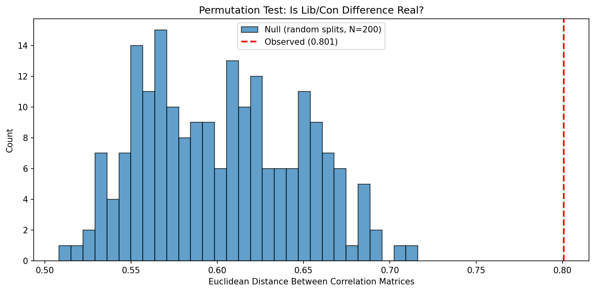
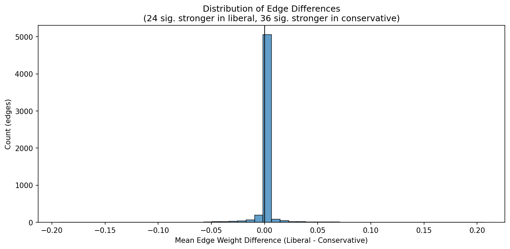
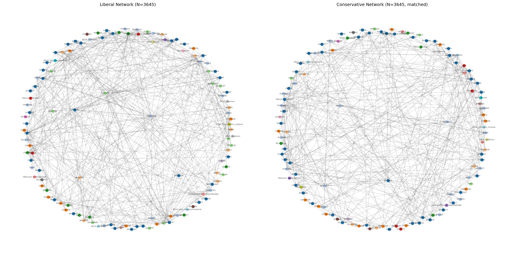

# Sound Liberal vs Conservative Comparison

**Notebook:** `notebooks/sound_02_lib_con_comparison.ipynb`
**Date:** 2026-02

## Question

Do liberal and conservative belief networks genuinely differ, or are the baseline findings artifacts of sample size and multiple testing?

## Design

Three methodological fixes over the baseline:

1. **Sample-size matching:** Downsample conservatives from 4,636 to 3,645 to match liberal N, so regularization behaves identically for both groups.
2. **Permutation test (200 iterations):** Shuffle lib/con labels to test whether the observed network difference exceeds chance.
3. **Bootstrap CIs (200 iterations):** Resample with replacement to get 95% confidence intervals on each edge difference.

**Period:** 2000-2010, regularized partial Pearson (alpha=0.2)

## 1. Sample Sizes

| Group | N (2000-2010) |
|-------|---------------|
| Liberal (POLVIEWS < 0) | 3,645 |
| Moderate (POLVIEWS = 0) | 5,242 |
| Conservative (POLVIEWS > 0) | 4,636 |
| Conservative matched | 3,645 |

## 2. Permutation Test: Global Structure

**Question:** Is the lib/con network difference larger than random splits of equal size?

| Metric | Value |
|--------|-------|
| Observed Euclidean distance (lib vs con) | 0.890 |
| Null mean (200 random splits) | 0.625 |
| Null std | 0.039 |
| Z-score | 6.81 |
| p-value | **< 0.001** |

**The lib/con difference is highly significant.** The observed distance between liberal and conservative networks is 6.8 standard deviations above what random splits of equal size produce. This is not sampling noise -- the two groups genuinely organize their beliefs differently.

## 3. Edge-Level Comparison with Bootstrap CIs

Of 6,903 possible edges, **60 (0.9%) have 95% CIs that exclude zero:**
- 23 edges significantly stronger in liberal network
- 37 edges significantly stronger in conservative network

### Top Edges Stronger in Liberal Network

| Variable 1 | Variable 2 | Mean Diff | 95% CI |
|-----------|-----------|-----------|--------|
| RELIG_Catholic | RELIG_Protestant | +0.206 | [+0.183, +0.230] |
| OBEY | WORKHARD | +0.101 | [+0.053, +0.144] |
| EQWLTH | HELPNOT | +0.093 | [+0.045, +0.150] |
| RACDIF4 | WRKWAYUP | +0.089 | [+0.046, +0.131] |
| DIVLAW | PREMARSX | +0.082 | [+0.050, +0.117] |

Liberals show stronger links between: religion categories, child-rearing values (OBEY-WORKHARD), economic redistribution attitudes, racial attribution beliefs, and moral traditionalism items.

### Top Edges Stronger in Conservative Network

| Variable 1 | Variable 2 | Mean Diff | 95% CI |
|-----------|-----------|-----------|--------|
| ABDEFECT | LETDIE1 | -0.129 | [-0.178, -0.067] |
| RELIG_Catholic | RELIG_None | -0.120 | [-0.140, -0.098] |
| HOMOSEX | PRAYER | -0.111 | [-0.172, -0.043] |
| RELIG_None | RELIG_Protestant | -0.107 | [-0.138, -0.076] |
| AFFRMACT | WRKWAYUP | -0.103 | [-0.151, -0.050] |

Conservatives show stronger links between: abortion and end-of-life (ABDEFECT-LETDIE1), religion and sexuality (HOMOSEX-PRAYER), religion categories, and racial individualism (AFFRMACT-WRKWAYUP).

## 4. Density Comparison (Sample-Size Controlled)

| Metric | Liberal | Con (matched) | Con (full) |
|--------|---------|---------------|------------|
| Edges | 405 | 356 | 349 |
| Density | 0.059 | 0.052 | 0.051 |
| Average degree | 6.86 | 6.03 | 5.92 |
| Avg weight sum | 0.419 | 0.429 | 0.425 |
| Clustering | 0.369 | 0.421 | 0.437 |
| Triangles | 531 | 411 | 401 |

**The liberal network is still denser after matching** (405 vs 356 edges, +14%). This is not a sample size artifact.

However, the conservative network has **higher clustering** (0.421 vs 0.369) and **higher average edge weight** (0.429 vs 0.419). Liberals have more connections but conservatives have tighter local clusters.

**Euclidean distance:** 0.890 (matched) vs 0.899 (full) -- nearly identical, confirming sample-size matching doesn't fundamentally change the comparison.

## 5. Community Comparison

| | Liberal | Conservative |
|---|---------|-------------|
| Total communities | 26 | 23 |
| Communities with 3+ members | 10 | 10 |

### Key structural differences:

1. **Conservatives merge abortion with morality.** Liberals separate abortion (L5, 10 members) from morality/family (L3, 15 members). Conservatives combine them into one large cluster (C2, 19 members: abortion + HOMOSEX + PREMARSX + GRASS + PORNLAW).

2. **Conservatives integrate partisan variables into the political cluster.** Liberal L9 separates PARTYID and PRESLAST_DEMREP (3 members) from the policy attitudes cluster (L1, 21 members). Conservatives merge them into one large cluster (C1, 29 members).

3. **Religion moves.** In the liberal network, religion variables cluster with morality (L3). In the conservative network, religion separates out (C6, 5 members: POSTLIFE, RELIG_*).

4. **20 variables switch communities** between lib and con, including PRAYER (morality -> civil liberties), CONCLERG (morality -> institutions), SEXEDUC (civil liberties -> morality), and TRUST (child-rearing values -> social trust).

## Key Takeaways

1. **The lib/con network difference is statistically significant** (permutation test p < 0.001, Z = 6.81). This is a genuine structural difference, not sampling noise.
2. **60 specific edges have significantly different weights** (bootstrap 95% CIs excluding zero). The differences are interpretable: liberals link economic redistribution beliefs more tightly; conservatives link moral-religious beliefs more tightly.
3. **Liberals have a denser network even after matching** (405 vs 356 edges). This is robust to sample size.
4. **Conservatives have higher clustering** (0.421 vs 0.369), suggesting tighter local belief clusters despite fewer total connections.
5. **Community structure reorganizes:** Conservatives merge abortion with morality and integrate partisan identity into the policy cluster. Liberals keep these domains more separate.

## Figures

