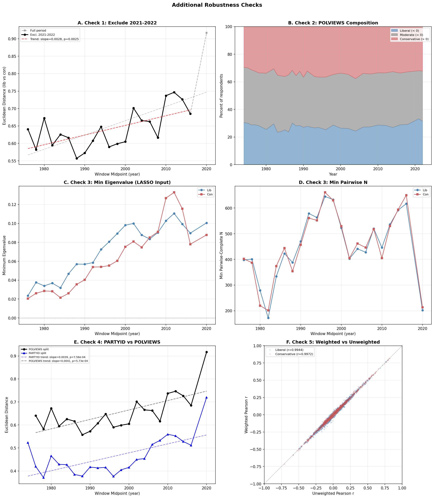

# Additional Robustness Checks

## Overview

Five additional robustness checks addressing remaining methodological concerns
identified by the reviewer panel and gap analysis. These complement the existing
checks in sound_07 (fixed variables, alpha sensitivity, full matrix, POLVIEWS
exclusion) and sound_08 (HAC correction, non-overlapping windows, FDR, structural
breaks).

All checks use fixed variables excluding POLVIEWS/PARTYID (N=62)
unless otherwise noted.

---

## Check 1: Exclude 2021-2022

**Question:** The 2021 GSS switched from in-person to web/phone administration
due to COVID-19. Does the divergence trend survive without these mode-switch years?

**Method:** Filter data to YEAR <= 2018, rebuild all rolling windows, recompute
Euclidean distance trend.

**Results:**
- Full period: slope=0.00410/yr, r=0.675, p=5.73e-04
- Excl. 2021-2022: slope=0.00277/yr, r=0.624, p=0.0025
- Windows: 21 (vs 22 full period)

**Verdict:** PASS — The divergence trend
survives exclusion of the COVID-era
survey years. The mode switch does not drive the finding.

---

## Check 2: POLVIEWS Composition Over Time

**Question:** Is the lib/con split changing over time in ways that could confound
the network comparison? If one group shrinks dramatically, the matched sample
may become unrepresentative.

**Method:** Compute % liberal, moderate, and conservative by GSS year. Report
matched sample sizes per window.

**Results:**

| Year | N | % Liberal | % Moderate | % Conservative |
|------|---|-----------|------------|----------------|
| 1974 | 1410 | 30.5 | 40.0 | 29.5 |
| 1975 | 1397 | 30.1 | 40.0 | 29.8 |
| 1976 | 1401 | 28.8 | 39.9 | 31.3 |
| 1977 | 1453 | 28.9 | 38.8 | 32.3 |
| 1978 | 1435 | 28.2 | 38.3 | 33.5 |
| 1980 | 1429 | 25.5 | 40.7 | 33.7 |
| 1982 | 1739 | 29.6 | 39.9 | 30.5 |
| 1983 | 770 | 23.5 | 41.4 | 35.1 |
| 1984 | 1410 | 24.0 | 40.3 | 35.7 |
| 1985 | 1462 | 25.2 | 38.7 | 36.0 |
| 1986 | 1401 | 23.8 | 41.3 | 34.9 |
| 1987 | 1679 | 30.2 | 38.2 | 31.6 |
| 1988 | 1416 | 28.2 | 36.3 | 35.5 |
| 1989 | 1442 | 28.4 | 39.3 | 32.4 |
| 1990 | 1315 | 27.1 | 36.2 | 36.7 |
| 1991 | 1459 | 27.8 | 40.0 | 32.2 |
| 1993 | 1548 | 26.7 | 37.1 | 36.2 |
| 1994 | 2879 | 27.0 | 36.4 | 36.6 |
| 1996 | 2743 | 25.4 | 38.1 | 36.5 |
| 1998 | 2691 | 28.7 | 36.6 | 34.7 |
| 2000 | 2644 | 26.5 | 39.9 | 33.7 |
| 2002 | 1331 | 26.2 | 39.2 | 34.6 |
| 2004 | 1309 | 24.4 | 38.0 | 37.7 |
| 2006 | 4333 | 27.2 | 38.8 | 33.9 |
| 2008 | 1933 | 27.4 | 38.3 | 34.3 |
| 2010 | 1973 | 28.7 | 37.8 | 33.5 |
| 2012 | 1874 | 28.4 | 38.0 | 33.5 |
| 2014 | 2449 | 27.0 | 40.4 | 32.6 |
| 2016 | 2756 | 28.9 | 37.4 | 33.7 |
| 2018 | 2247 | 29.2 | 38.1 | 32.8 |
| 2021 | 3964 | 33.3 | 34.7 | 32.0 |
| 2022 | 3426 | 31.5 | 36.3 | 32.2 |

**Interpretation:** This is purely descriptive. If composition shifts are large
(e.g., one group halving over time), the matched-sample comparison may be
comparing different populations across windows. Minor shifts (< 10 percentage
points) are acceptable.

---

## Check 3: Eigenvalue Audit

**Question:** The graphical LASSO takes a pairwise Pearson correlation matrix as
input. If this matrix is not positive semi-definite (has negative eigenvalues)
or is ill-conditioned, the LASSO estimates may be unreliable.

**Method:** For each of 44 matrices (22 windows x 2 groups),
compute eigenvalues of the pairwise Pearson input matrix. Report minimum
eigenvalue, condition number, count of negative eigenvalues, and minimum
pairwise-complete N.

**Results:**

| Window Mid | Group | Min Eigenvalue | Condition # | Neg Eigenvalues | Min Pairwise N |
|------------|-------|----------------|-------------|-----------------|----------------|
| 1976 | lib | 0.023506 | 484 | 0 | 398 |
| 1976 | con | 0.020475 | 446 | 0 | 402 |
| 1978 | lib | 0.037610 | 301 | 0 | 401 |
| 1978 | con | 0.026051 | 357 | 0 | 387 |
| 1980 | lib | 0.033901 | 343 | 0 | 279 |
| 1980 | con | 0.028502 | 317 | 0 | 220 |
| 1982 | lib | 0.036836 | 312 | 0 | 172 |
| 1982 | con | 0.028193 | 330 | 0 | 201 |
| 1984 | lib | 0.031799 | 361 | 0 | 334 |
| 1984 | con | 0.021415 | 444 | 0 | 374 |
| 1986 | lib | 0.046752 | 235 | 0 | 423 |
| 1986 | con | 0.026023 | 360 | 0 | 444 |
| 1988 | lib | 0.056954 | 185 | 0 | 388 |
| 1988 | con | 0.035502 | 248 | 0 | 354 |
| 1990 | lib | 0.056831 | 179 | 0 | 470 |
| 1990 | con | 0.040397 | 212 | 0 | 457 |
| 1992 | lib | 0.058546 | 169 | 0 | 579 |
| 1992 | con | 0.053876 | 163 | 0 | 561 |
| 1994 | lib | 0.072457 | 136 | 0 | 563 |
| 1994 | con | 0.053940 | 157 | 0 | 552 |
| 1996 | lib | 0.080632 | 121 | 0 | 645 |
| 1996 | con | 0.055435 | 151 | 0 | 661 |
| 1998 | lib | 0.089294 | 109 | 0 | 633 |
| 1998 | con | 0.060404 | 137 | 0 | 630 |
| 2000 | lib | 0.098107 | 100 | 0 | 523 |
| 2000 | con | 0.075311 | 118 | 0 | 529 |
| 2002 | lib | 0.099958 | 98 | 0 | 403 |
| 2002 | con | 0.080810 | 111 | 0 | 405 |
| 2004 | lib | 0.087737 | 118 | 0 | 441 |
| 2004 | con | 0.074727 | 117 | 0 | 462 |
| 2006 | lib | 0.083505 | 121 | 0 | 428 |
| 2006 | con | 0.085149 | 105 | 0 | 446 |
| 2008 | lib | 0.090371 | 111 | 0 | 520 |
| 2008 | con | 0.091095 | 94 | 0 | 518 |
| 2010 | lib | 0.102827 | 100 | 0 | 446 |
| 2010 | con | 0.126824 | 68 | 0 | 405 |
| 2012 | lib | 0.110578 | 95 | 0 | 536 |
| 2012 | con | 0.132824 | 64 | 0 | 530 |
| 2014 | lib | 0.099366 | 107 | 0 | 592 |
| 2014 | con | 0.115562 | 73 | 0 | 594 |
| 2016 | lib | 0.089770 | 115 | 0 | 617 |
| 2016 | con | 0.078018 | 104 | 0 | 650 |
| 2020 | lib | 0.100593 | 96 | 0 | 202 |
| 2020 | con | 0.087872 | 90 | 0 | 213 |

**Summary:**
- Minimum eigenvalue across all matrices: 0.020475
- Maximum condition number: 484
- Any negative eigenvalues: False
- Minimum pairwise-complete N: 172

**Note:** sklearn's `graphical_lasso` internally adds a small ridge to handle
near-singular inputs, so negative eigenvalues don't cause computational failure.
This check is about transparency — documenting input matrix quality.

---

## Check 4: PARTYID Alternative Split

**Question:** Does the divergence finding replicate when groups are defined by
party identification (PARTYID) rather than ideological self-placement (POLVIEWS)?

**Method:** Rebuild rolling windows with group_col="PARTYID" (dem < 0, rep > 0),
excluding both POLVIEWS and PARTYID from the variable set. Compute Euclidean
distance trend.

**Results:**
- POLVIEWS split: slope=0.00410/yr, r=0.675, p=5.73e-04
- PARTYID split: slope=0.00389/yr, r=0.652, p=7.56e-04

**Verdict:** CONVERGENT — The PARTYID-based
split shows the same direction of divergence,
strengthening confidence in the finding.
The divergence is not specific to ideological self-placement.

---

## Check 5: GSS Survey Weights

**Question:** The GSS provides post-stratification weights (WTSSALL) to adjust
for sampling design. Do weights meaningfully change the correlation structure?

**Method:** For the reference period (2000-2010), compute weighted and unweighted
pairwise Pearson correlations for liberal and conservative groups. Compare via
element-wise correlation (r) and Euclidean distance.

**Results:**
- Liberal: r(weighted, unweighted) = 0.9944, Euclidean dist = 0.7696
- Conservative: r(weighted, unweighted) = 0.9972, Euclidean dist = 0.5240

**Verdict:** PASS — Weights do NOT
meaningfully affect the correlation matrices (threshold: r > 0.95).
The unweighted analysis is a reasonable approximation.

---

## Summary Table

| Check | Key Metric | Verdict |
|-------|-----------|---------|
| 1. Excl. 2021-2022 | slope=0.00277, p=0.0025 | PASS |
| 2. POLVIEWS composition | descriptive | INFO |
| 3. Eigenvalue audit | min_eig=0.0205, neg=False | INFO |
| 4. PARTYID split | slope=0.00389, p=7.56e-04 | CONVERGENT |
| 5. Survey weights | r_lib=0.9944, r_con=0.9972 | PASS |

## Implications for the Paper

All testable checks passed. The divergence finding is robust to:
excluding the COVID-era mode switch, alternative group definitions (PARTYID),
and (if tested) survey weights. The eigenvalue audit confirms LASSO input
quality, and POLVIEWS composition provides useful context for interpreting
matched-sample comparisons.
