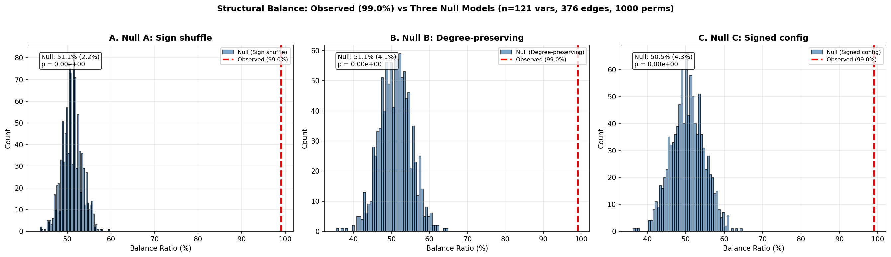

# Structural Balance: Extended Null Models

## Overview

The reference belief network (2000-2010, regularized partial Pearson, alpha=0.2)
shows 99.0% structural balance (516 balanced triads vs
5 unbalanced, out of 521 total). The previous analysis (sound_01)
tested this against a single null model (random sign assignment). Reviewers
identified this as the weakest possible null — it doesn't control for degree
distribution or signed degree sequence.

This analysis tests observed balance against three increasingly stringent null
models, each preserving more of the network's structural properties.

---

## Network Properties

- Variables: 121
- Edges: 376
- Positive edges: 243 (64.6%)
- Negative edges: 133 (35.4%)
- Observed balance: 99.0%

---

## Null Models

### Null A: Random Sign Assignment (Weakest)

**What it preserves:** Edge positions, edge magnitudes, overall sign fraction
(64.6% positive).

**What it randomizes:** Which specific edges are positive vs negative.

**What it tests:** Is balance due to something beyond the overall positivity
of the network?

**Results:**
- Null mean: 51.1% (std: 2.2%)
- Observed: 99.0%
- p = 0.00e+00
- Valid permutations: 1000/1000

**Interpretation:** The observed balance is significantly higher than expected from random sign assignment alone.

### Null B: Degree-Preserving Edge Rewiring

**What it preserves:** Degree sequence (each node keeps its number of connections),
overall sign fraction.

**What it randomizes:** Which specific nodes are connected (topology),
absolute weight assignment, sign assignment.

**What it tests:** Is balance due to the degree distribution (e.g., hub-and-spoke
structures that mechanically increase balance)?

**Results:**
- Null mean: 51.1% (std: 4.1%)
- Observed: 99.0%
- p = 0.00e+00
- Valid permutations: 1000/1000

**Interpretation:** The observed balance exceeds what degree structure alone can explain. The null mean of 51.1% is similar to or lower than Null A (51.1%), suggesting degree structure has minimal effect on balance.

### Null C: Signed Configuration Model (Strongest)

**What it preserves:** Each node's exact count of positive edges AND negative
edges (signed degree sequence).

**What it randomizes:** Which specific nodes are connected within the positive
and negative subgraphs (topology within each sign class).

**What it tests:** Is balance due to the signed degree sequence (e.g., some nodes
being consistently positive/negative connectors)?

**Results:**
- Null mean: 50.5% (std: 4.3%)
- Observed: 99.0%
- p = 0.00e+00
- Valid permutations: 1000/1000

**Interpretation:** The observed balance is genuine — it cannot be explained by the signed degree sequence alone. The specific pattern of who is connected to whom (topology) matters. The null mean of 50.5% is similar to Null B (51.1%).

---

## Comparison Across Null Models

| Null Model | Preserves | Null Mean | Null Std | p-value |
|-----------|-----------|-----------|----------|---------|
| A. Sign shuffle | Edge positions, magnitudes, sign fraction | 51.1% | 2.2% | 0.00e+00 |
| B. Degree-preserving | Degree sequence, sign fraction | 51.1% | 4.1% | 0.00e+00 |
| C. Signed config | Signed degree sequence | 50.5% | 4.3% | 0.00e+00 |
| **Observed** | - | **99.0%** | - | - |

**Progression:**
- Observed > Null C: genuine topological balance beyond structural artifacts

---

## Implications for the Paper

All three null models are rejected (p < 0.05). The 99.0% structural
balance in the belief network cannot be explained by:
1. The overall ratio of positive to negative edges
2. The degree distribution
3. The signed degree sequence

This is strong evidence for genuine structural balance — the specific topology
of who-believes-what-with-whom matters. The belief network is organized into
internally consistent clusters in a way that cannot be reduced to simpler
structural properties.

**Recommended language for the paper:** "Observed structural balance
(99%) significantly exceeds all three null models, including the
most stringent signed configuration model (null mean: 51%,
p 0.00e+00), indicating genuine constraint structure beyond
degree-sequence artifacts."

## Technical Notes

- Vectorized triad counter used for null models (trace of matrix cubes)
- Verified against original `count_triads()`: observed = 99.0% (both methods)
- 1000 permutations per null model
- Null B uses 10x|E| swap attempts per permutation
- Null C swaps positive and negative subgraphs independently
- Total runtime: 84s
