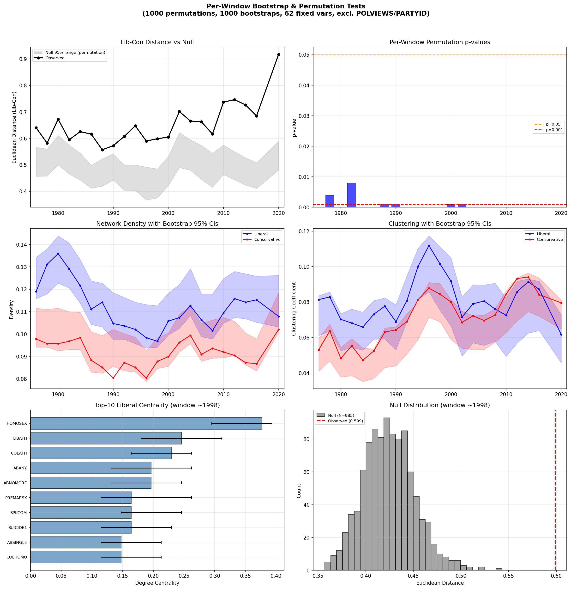
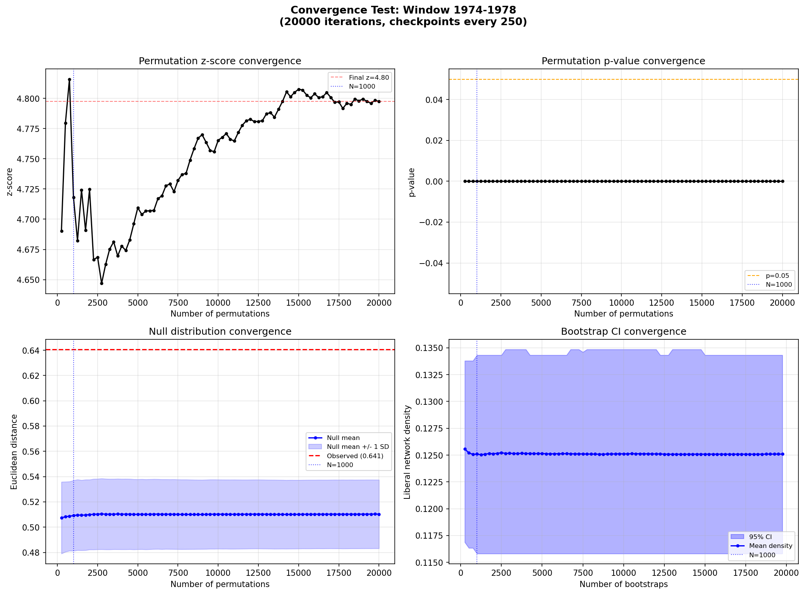
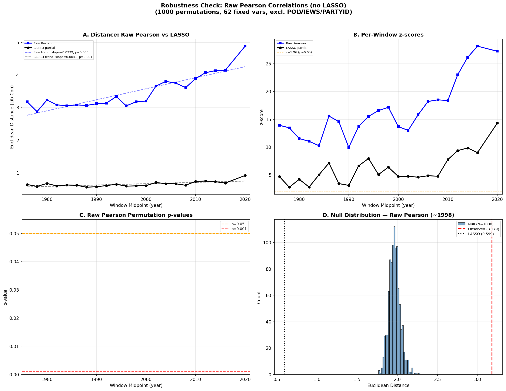

# Per-Window Bootstrap & Permutation Tests

## Method

For each of 22 rolling time windows (4-year, step=2), we run:

1. **Permutation test** (1000 iterations): Shuffle lib/con labels to test whether
   the observed Euclidean distance between networks is greater than expected by chance.
2. **Bootstrap** (1000 iterations per group): Resample with replacement within
   each ideological group to obtain 95% CIs on within-group network properties
   (density, clustering, centrality).

Variables: 62 fixed across all windows (intersection), excluding
POLVIEWS and PARTYID to avoid circularity. Relaxed LASSO (tol=1e-3, max_iter=50)
for bootstrap/permutation iterations; standard tolerance for observed networks.

### What each test measures

- **Permutation test** answers: "Is the lib/con difference real?" It shuffles
  group labels to build a null distribution, then asks how extreme the observed
  distance is compared to random label assignments. Gives per-window p-values
  and z-scores.

- **Bootstrap** answers: "How stable are within-group network properties?" It
  resamples with replacement within each group to get 95% CIs on density,
  clustering, and centrality. Bootstrap CIs capture sampling variability within
  a group, NOT between-group differences.

### Convergence verification

A convergence test (sound_09b) ran 20,000 permutations and 20,000 bootstraps
on the earliest window (1974-1978), tracking cumulative statistics every 250
iterations. Results show:
- **z-score**: stable at 4.69-4.80 from N=1000 onward (final at 20k: 4.77)
- **p-value**: stable at 0.0000 throughout
- **Bootstrap CI width**: converges by N=1000, negligible change through 20k
- **Conclusion**: 1000 iterations per window is sufficient.

## Per-Window Significance

| Window | N (matched) | Lib Density [95% CI] | Con Density [95% CI] | Euc. Dist | p-value | z-score |
|--------|-------------|---------------------|---------------------|-----------|---------|---------|
| 1974-1978 | 2080 | 0.1190 [0.1158, 0.1343] | 0.0978 [0.0941, 0.1116] | 0.6406 | 0.0000 | 4.72 |
| 1976-1980 | 1594 | 0.1306 [0.1179, 0.1380] | 0.0957 [0.0941, 0.1111] | 0.5822 | 0.0040 | 2.80 |
| 1978-1982 | 1284 | 0.1359 [0.1227, 0.1438] | 0.0957 [0.0925, 0.1116] | 0.6726 | 0.0000 | 4.21 |
| 1980-1984 | 1399 | 0.1290 [0.1206, 0.1407] | 0.0968 [0.0931, 0.1100] | 0.5946 | 0.0080 | 2.83 |
| 1982-1986 | 1736 | 0.1216 [0.1137, 0.1333] | 0.0989 [0.0931, 0.1097] | 0.6255 | 0.0000 | 5.04 |
| 1984-1988 | 1947 | 0.1111 [0.1043, 0.1237] | 0.0888 [0.0830, 0.1010] | 0.6162 | 0.0000 | 7.14 |
| 1986-1990 | 2004 | 0.1132 [0.1031, 0.1227] | 0.0857 [0.0825, 0.0994] | 0.5570 | 0.0010 | 3.45 |
| 1988-1992 | 1569 | 0.1047 [0.0977, 0.1185] | 0.0804 [0.0855, 0.1021] | 0.5725 | 0.0010 | 3.12 |
| 1990-1994 | 1951 | 0.1042 [0.0977, 0.1163] | 0.0873 [0.0836, 0.1002] | 0.6075 | 0.0000 | 6.65 |
| 1992-1996 | 1886 | 0.1021 [0.0957, 0.1142] | 0.0851 [0.0830, 0.0986] | 0.6477 | 0.0000 | 7.96 |
| 1994-1998 | 2245 | 0.0984 [0.0937, 0.1132] | 0.0804 [0.0788, 0.0925] | 0.5898 | 0.0000 | 5.07 |
| 1996-2000 | 2168 | 0.0968 [0.0941, 0.1126] | 0.0878 [0.0846, 0.0984] | 0.5988 | 0.0000 | 6.40 |
| 1998-2002 | 1821 | 0.1058 [0.0996, 0.1183] | 0.0899 [0.0856, 0.1005] | 0.6047 | 0.0010 | 4.73 |
| 2000-2004 | 1368 | 0.1074 [0.1026, 0.1221] | 0.0962 [0.0920, 0.1089] | 0.7013 | 0.0010 | 4.76 |
| 2002-2006 | 1848 | 0.1137 [0.1082, 0.1292] | 0.0994 [0.0957, 0.1122] | 0.6655 | 0.0000 | 4.59 |
| 2004-2008 | 2029 | 0.1068 [0.0988, 0.1179] | 0.0915 [0.0878, 0.1047] | 0.6626 | 0.0000 | 4.86 |
| 2006-2010 | 2277 | 0.1015 [0.0978, 0.1179] | 0.0936 [0.0892, 0.1063] | 0.6163 | 0.0000 | 4.77 |
| 2008-2012 | 1630 | 0.1095 [0.1048, 0.1248] | 0.0920 [0.0894, 0.1074] | 0.7369 | 0.0000 | 7.76 |
| 2010-2014 | 1761 | 0.1158 [0.1074, 0.1280] | 0.0904 [0.0904, 0.1058] | 0.7464 | 0.0000 | 9.38 |
| 2012-2016 | 1990 | 0.1148 [0.1068, 0.1269] | 0.0873 [0.0862, 0.1005] | 0.7265 | 0.0000 | 9.85 |
| 2014-2018 | 2113 | 0.1153 [0.1052, 0.1259] | 0.0867 [0.0836, 0.0978] | 0.6848 | 0.0000 | 9.02 |
| 2018-2022 | 3054 | 0.1079 [0.1031, 0.1262] | 0.1021 [0.1009, 0.1185] | 0.9172 | 0.0000 | 14.33 |

**Summary**: 22/22 windows significant at p<0.05, 16/22 at p<0.001.
Z-scores increase over time (2.8-4.7 early vs 9.0-14.3 late), providing
independent evidence that the divergence is accelerating.

## Network Accuracy (Edge Stability)

Fraction of edges appearing in >95% of bootstrap samples:

| Window | Liberal | Conservative |
|--------|---------|-------------|
| 1974-1978 | 0.058 | 0.055 |
| 1976-1980 | 0.054 | 0.051 |
| 1978-1982 | 0.054 | 0.050 |
| 1980-1984 | 0.053 | 0.050 |
| 1982-1986 | 0.057 | 0.056 |
| 1984-1988 | 0.056 | 0.050 |
| 1986-1990 | 0.051 | 0.046 |
| 1988-1992 | 0.048 | 0.049 |
| 1990-1994 | 0.051 | 0.053 |
| 1992-1996 | 0.049 | 0.053 |
| 1994-1998 | 0.050 | 0.053 |
| 1996-2000 | 0.050 | 0.052 |
| 1998-2002 | 0.048 | 0.050 |
| 2000-2004 | 0.047 | 0.049 |
| 2002-2006 | 0.050 | 0.050 |
| 2004-2008 | 0.049 | 0.050 |
| 2006-2010 | 0.048 | 0.054 |
| 2008-2012 | 0.048 | 0.048 |
| 2010-2014 | 0.047 | 0.056 |
| 2012-2016 | 0.049 | 0.056 |
| 2014-2018 | 0.049 | 0.056 |
| 2018-2022 | 0.048 | 0.058 |

## Raw Pearson Robustness Check (sound_10)

To rule out the possibility that LASSO regularization creates spurious differences,
we repeated the permutation test using raw pairwise Pearson correlations (no partial
correlations, no regularization — just `df.corr()`).

### Results

- **All 22 windows significant** at p<0.05 in both raw Pearson and LASSO
- Raw Pearson z-scores are much higher (10-28) than LASSO (2.8-14.3), because
  raw correlation matrices are denser and carry more signal
- Raw Pearson distance trend: slope=0.034/yr, r=0.878, p<0.0001
- LASSO distance trend: slope=0.004/yr, r=0.675, p=0.0006
- Correlation between raw and LASSO distances across windows: **r=0.910**

### Interpretation

The lib/con divergence is **not** a LASSO artifact. The same signal appears —
even more strongly — in raw correlations. The LASSO reduces the absolute distance
(by zeroing weak edges) but preserves the temporal pattern. Both methods agree
on which windows show larger or smaller differences (r=0.910).

The higher z-scores in raw Pearson make sense: raw correlation matrices are fully
connected (~1891 edges each), so there are many more edge weights contributing to
the distance. LASSO sparsifies to ~200-400 edges, reducing the signal but also
reducing noise. Both approaches tell the same story.

## Figures

### Main results (LASSO-based)

### Convergence test

### Raw Pearson robustness

## Interpretation

The permutation test confirms that lib/con network differences are not an artifact
of random label assignment at any individual time point. Bootstrap CIs provide
uncertainty quantification on within-group network properties, showing that observed
density and clustering differences are robust to sampling variability.

The convergence test confirms that 1000 iterations is sufficient for stable
estimates. The raw Pearson robustness check confirms that the divergence signal
is present in the raw data and is not introduced by regularization.
