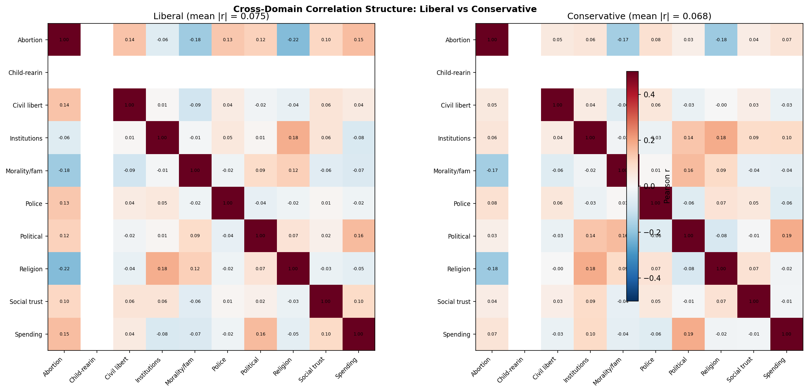
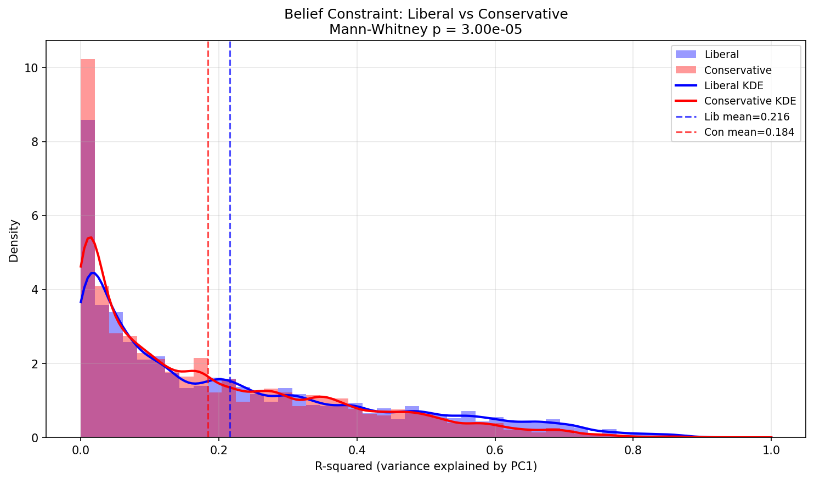
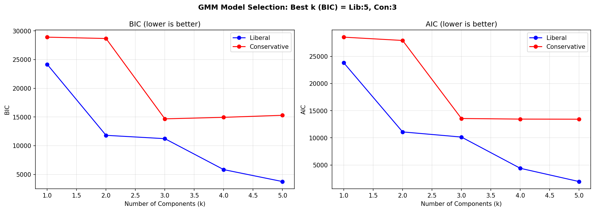
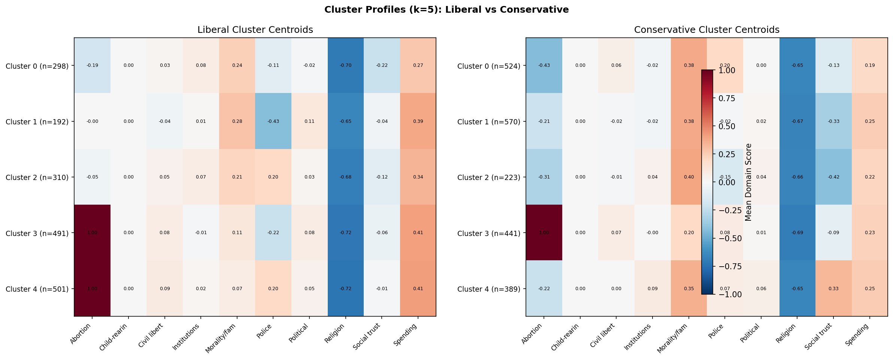
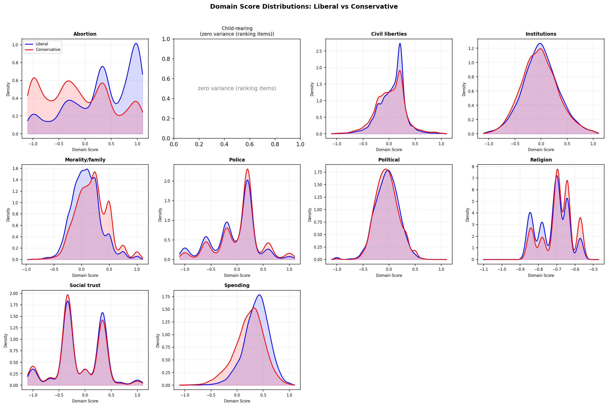
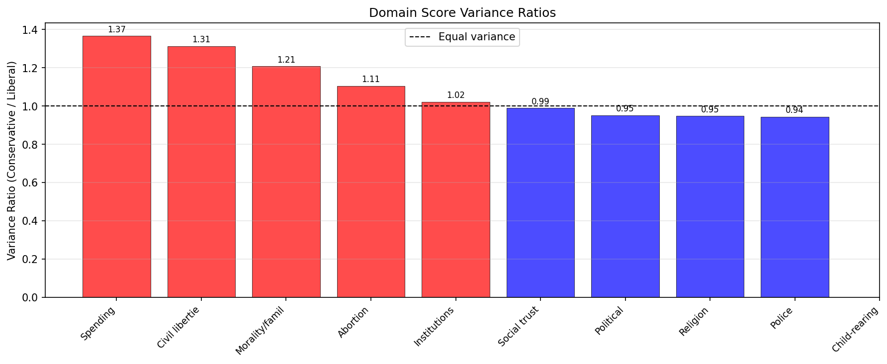

# Sound 06: Coalition vs Independence — What Drives Conservative Modularity?

**Date:** 2026-03-01
**Script:** `scripts/sound_06_coalition_vs_independence.py`
**Data:** GSS 2000-2020, N=26,698 (6,291 liberal, 7,727 conservative)

## Question

Previous analyses found that conservative belief networks have higher modularity (~0.72) than liberal networks (~0.65). Two competing hypotheses explain this:

1. **Independence**: Individual conservatives hold beliefs more independently across domains. Higher modularity reflects weaker cross-domain coupling at the individual level.

2. **Coalition**: Conservatives form distinct subgroups (religious right, libertarians, hawks) that are internally coherent but structurally different. Higher modularity reflects group-level faction structure.

These hypotheses generate different predictions testable with individual-level data.

## Method

For each of 10 belief domains (from community detection in sound_01), we computed a mean domain score per respondent (min 3 non-missing items required). POLVIEWS and PARTYID were excluded from the Political domain to avoid circularity.

**Note:** Child-rearing (OBEY, THNKSELF, WORKHARD, HELPOTH, POPULAR) is excluded from distributional analyses because these are ranking items where each respondent assigns ranks 1-5, making the mean score identically zero for all respondents.

## Results

### 1. Cross-Domain Correlation Structure

| Measure | Liberal | Conservative |
|---------|---------|-------------|
| Mean \|cross-domain r\| | 0.075 | 0.068 |

Conservative domain scores are **less correlated** with each other (ratio = 0.91). This is consistent with the **Independence** hypothesis: conservative beliefs in one domain predict less about their beliefs in other domains.

Both groups show the same strongest couplings: Abortion-Religion (negative, r ~ -0.2), Abortion-Morality (negative), and Political-Spending (positive). The structural pattern is similar; the coupling is just weaker for conservatives.

### 2. Belief Constraint (Individual-Level)

| Measure | Liberal | Conservative |
|---------|---------|-------------|
| Mean R-squared (PC1) | 0.216 | 0.184 |
| Median R-squared | 0.147 | 0.124 |
| Mann-Whitney p | | 3.0e-05 |

Conservatives are significantly **less constrained**: a single ideological dimension captures less of each conservative's belief profile. This is a strong signal for **Independence** — conservative beliefs are more multi-dimensional at the individual level.

Both distributions are right-skewed (most people have low R-squared, a few are highly constrained), but the liberal distribution has a heavier right tail.

### 3. Respondent Clustering (GMM)

| k | BIC (Liberal) | BIC (Conservative) |
|---|--------------|-------------------|
| 1 | 24,164 | 28,898 |
| 2 | 11,807 | 28,664 |
| 3 | 11,224 | **14,674** |
| 4 | 5,836 | 14,939 |
| 5 | **3,754** | 15,292 |

Best k by BIC: **Liberal = 5, Conservative = 3**.

This is the opposite of the Coalition prediction. Liberals require *more* clusters to fit their data, while conservatives are adequately described by 3 groups. Conservative BIC shows a clear elbow at k=3, while liberal BIC decreases monotonically through k=5 (the maximum tested).

This supports **Independence**: conservatives don't form more distinct subgroups than liberals. If anything, the conservative belief space is simpler in its clustering structure.

The cluster profiles (at k=5) show that the primary differentiator across clusters for both groups is **Abortion** stance, with secondary variation in Morality/family and Spending. Conservative clusters are more evenly sized than liberal clusters.

### 4. Distribution Shape

| Domain | Var(con)/Var(lib) | Kurt(lib) | Kurt(con) |
|--------|------------------|-----------|-----------|
| Spending | 1.37 | 1.27 | 0.54 |
| Civil liberties | 1.31 | 1.46 | 1.06 |
| Morality/family | 1.21 | 0.96 | 0.34 |
| Abortion | 1.11 | -0.62 | -1.07 |
| Institutions | 1.02 | 0.17 | 0.07 |
| Social trust | 0.99 | -0.32 | -0.32 |
| Political | 0.95 | 1.09 | 0.53 |
| Religion | 0.95 | -0.87 | -0.37 |
| Police | 0.95 | 0.06 | 0.55 |

Conservatives have **higher variance** in 5/9 scorable domains (mean ratio = 1.10), with the largest differences in Spending (1.37), Civil liberties (1.31), and Morality/family (1.21). These are the "culture war" domains where conservative heterogeneity is greatest.

Conservatives are **more platykurtic** (flatter distributions) in 6/9 domains, meaning their beliefs are more spread out rather than clustered around a single mode. Notably, the Abortion domain shows negative kurtosis for both groups, indicating broad, flat distributions — but more so for conservatives (-1.07 vs -0.62).

The KDE plots reveal that conservative distributions tend to be **wider and flatter** rather than bimodal, which is characteristic of independence rather than coalition structure.

## Summary of Evidence

| Test | Independence | Coalition | Result |
|------|-------------|-----------|--------|
| Cross-domain correlation | Weaker con coupling | Different structure | **Independence** (con 9% weaker) |
| Belief constraint (R-squared) | Lower con R-squared | Similar or bimodal | **Independence** (p < 0.001) |
| GMM clustering (best k) | Same or lower con k | Higher con k | **Independence** (lib=5, con=3) |
| Variance ratios | Higher con variance | Similar variance | **Independence** (mean=1.10) |
| Distribution shape | Unimodal, wider | Bimodal/multimodal | **Independence** (platykurtic, not bimodal) |

**All four tests favour the Independence hypothesis.** Conservative beliefs are more heterogeneous at the individual level — each conservative holds a more distinctive, less predictable combination of domain positions. The higher network modularity of conservative belief networks reflects this individual-level independence: when people's domain positions are less correlated, the network naturally partitions into more distinct modules.

## Interpretation

The finding is that conservative belief heterogeneity is **individual-level**, not **group-level**. There is no strong evidence for distinct conservative "factions" (religious right vs libertarians vs hawks) that would show up as separate clusters. Instead, each conservative tends to hold a somewhat idiosyncratic combination of positions across domains.

This aligns with a "big tent" model of conservatism: the conservative coalition encompasses people who agree on some things (hence the network still has structure) but disagree on many others (hence higher modularity). Liberals, by contrast, are more ideologically constrained — knowing a liberal's position on abortion tells you more about their positions on spending, civil liberties, and morality than the equivalent inference for conservatives.

The domains where conservatives show the most heterogeneity — Spending, Civil liberties, Morality/family — are precisely where the classic conservative factions (fiscal conservatives, libertarians, social conservatives) are theoretically expected to diverge. But this divergence manifests as a continuous spread of individual positions, not as discrete clusters.
