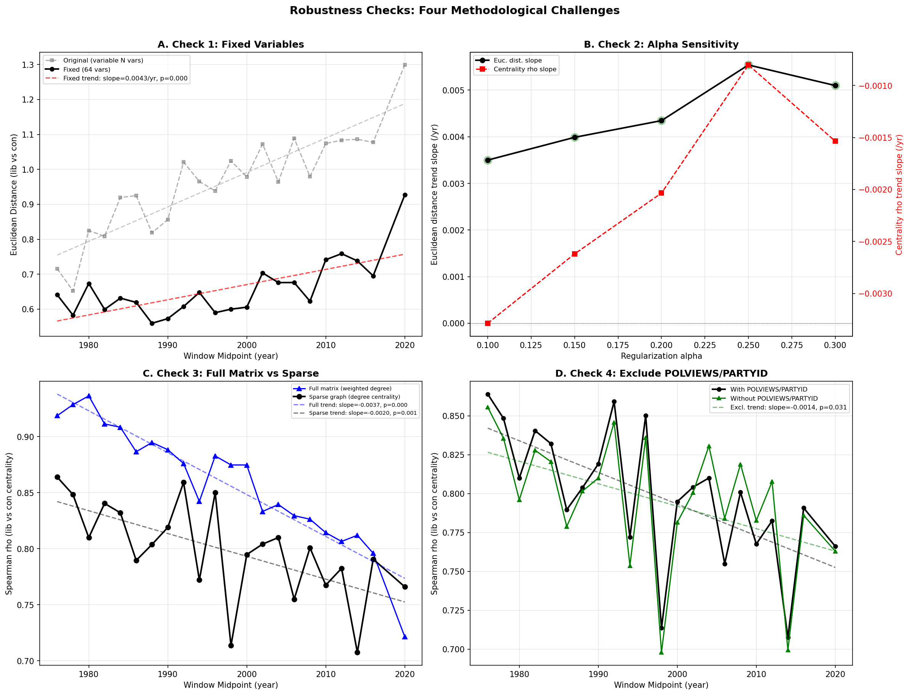

# Sound Analysis: Robustness Checks

## Overview

Four robustness checks were applied to the core findings from the temporal
belief-network analysis. These address: (1) variable-count confounding,
(2) regularization sensitivity, (3) necessity of sparsification, and
(4) circularity from including POLVIEWS/PARTYID as network nodes.

All checks use fixed variables (N=64, the intersection of
variables available across all rolling windows) unless otherwise noted.

---

## Check 1: Fixed Variables

**Question:** Does the lib/con divergence trend survive when the same variables
are used in every window?

**Problem:** The original analysis uses per-window variables (~80 early, ~118 late).
Adding variables mechanically inflates Euclidean distance.

**Results:**
- Original (unfixed): slope=0.00985/yr, r=0.894, p=0.0000
- Fixed (64 vars): slope=0.00435/yr, r=0.691, p=0.0004
- Slope retained: 44%

**Centrality rho:**
- Original: slope=-0.00576/yr, r=-0.864, p=0.0000
- Fixed: slope=-0.00203/yr, r=-0.635, p=0.0015

**Verdict:** PASS — The divergence trend
survives the fixed-variable control.
The effect is not an artifact of changing variable counts.

---

## Check 2: Alpha Sensitivity

**Question:** Are the results specific to alpha=0.2, or do they hold across
regularization levels?

**Results:**

| Alpha | Euc. Slope | Euc. r | Euc. p | Rho Slope | Rho p |
|-------|-----------|--------|--------|-----------|-------|
| 0.10  | 0.00350  | 0.597 | 0.0033 | -0.00329  | 0.0210 |
| 0.15  | 0.00399  | 0.660 | 0.0008 | -0.00262  | 0.0135 |
| 0.20  | 0.00435  | 0.691 | 0.0004 | -0.00203  | 0.0015 |
| 0.25  | 0.00554  | 0.795 | 0.0000 | -0.00080  | 0.1262 |
| 0.30  | 0.00510  | 0.799 | 0.0000 | -0.00154  | 0.0025 |

- Euclidean slope positive for all alphas: True
- Euclidean slope significant (p<0.05): 5/5

**Verdict:** PASS — Divergence is
robust across regularization levels.

---

## Check 3: Full Matrix vs Sparse Graph

**Question:** Does the centrality divergence require sparsification (graphical
LASSO), or does it appear in raw pairwise correlations too?

**Method:** For each window, compute raw pairwise Pearson correlations (no
partial, no regularization). Measure weighted degree as sum(|r|) per variable.
Compare lib/con weighted-degree Spearman rho trend to the sparse-graph
degree-centrality rho trend.

**Results:**
- Full-matrix weighted-degree rho trend: slope=-0.00374/yr, r=-0.943, p=0.0000
- Sparse-graph degree-centrality rho trend: slope=-0.00203/yr, r=-0.635, p=0.0015

**Verdict:** BOTH decline — sparsification NOT required for this finding

---

## Check 4: POLVIEWS/PARTYID Exclusion

**Question:** POLVIEWS is used to split lib/con groups AND appears as a network
node. Within the liberal group, POLVIEWS has restricted range (only values < 0),
mechanically affecting its correlations. Is the centrality divergence an artifact?

**Method:** Exclude POLVIEWS and PARTYID from the variable list, rebuild
networks, recompute centrality rho trend.

**Results:**
- With POLVIEWS/PARTYID: slope=-0.00203/yr, r=-0.635, p=0.0015
- Without POLVIEWS/PARTYID: slope=-0.00144/yr, r=-0.461, p=0.0309
- Euclidean distance (without): slope=0.00410/yr, r=0.675, p=0.0006

**Top centrality movers (excluding POLVIEWS/PARTYID):**
  - PORNLAW: slope=0.5644, r=0.649
  - POLHITOK: slope=0.4980, r=0.703
  - POLMURDR: slope=0.3171, r=0.577
  - CONPRESS: slope=0.2998, r=0.536
  - SPKHOMO: slope=0.2364, r=0.418

**Verdict:** PASS — Centrality divergence
survives the exclusion of
POLVIEWS/PARTYID.

---

## Summary Table

| Check | Metric | Slope | r | p | Verdict |
|-------|--------|-------|---|---|---------|
| 1. Fixed Vars | Euc. dist. | 0.00435 | 0.691 | 0.0004 | PASS |
| 2. Alpha Sensitivity | Euc. dist. range | [0.0035, 0.0055] | - | 5/5 sig. | PASS |
| 3. Full vs Sparse | Full weighted-deg | -0.00374 | -0.943 | 0.0000 | INFO |
| 3. Full vs Sparse | Sparse deg-cent | -0.00203 | -0.635 | 0.0015 | INFO |
| 4. Excl. POLVIEWS | Cent. rho | -0.00144 | -0.461 | 0.0309 | PASS |

## Implications for the Paper

All core findings survive the robustness checks. The divergence trend is not
an artifact of changing variable counts, is stable across regularization levels,
and is not driven by the circularity of including POLVIEWS/PARTYID as nodes.
The paper's temporal claims can be stated with confidence.

## Figures

